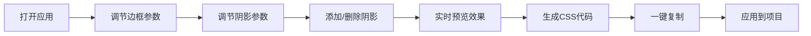

## 1. 产品概述

CSS 边框阴影调试工具是一个面向前端开发者的可视化 CSS 样式调试应用，帮助用户通过直观的滑块、颜色选择器等控件实时调整边框和阴影参数，即时预览效果并一键复制生成的 CSS 代码。

- 核心价值：将抽象的 CSS 属性转化为可视化操作，大幅提升样式调试效率
- 目标用户：前端开发者、UI 设计师、网页制作爱好者
- 市场定位：轻量级、高颜值的在线 CSS 调试工具

## 2. 核心功能

### 2.1 功能模块

1. **边框控制面板**：宽度、样式、颜色、圆角调节
2. **阴影控制面板**：水平/垂直偏移、模糊半径、扩展半径、颜色调节
3. **实时预览区**：展示当前参数应用到盒子上的视觉效果
4. **CSS 代码生成器**：自动生成对应的 CSS 代码，支持一键复制
5. **多阴影管理**：支持添加/删除多个阴影，支持内阴影/外阴影切换

### 2.2 页面详情

| 页面名称 | 模块名称 | 功能描述 |
|---------|---------|---------|
| 主页 | 标题区 | 应用名称、副标题、主题切换 |
| 主页 | 预览区 | 居中展示的预览盒子，实时反映样式变化 |
| 主页 | 边框控制面板 | 边框宽度滑块、样式选择器、颜色选择器、圆角滑块 |
| 主页 | 阴影控制面板 | 阴影列表、添加/删除阴影、内/外阴影切换、各参数调节 |
| 主页 | 代码输出区 | 展示生成的 CSS 代码，一键复制按钮 |

## 3. 核心流程

用户打开应用 → 调节边框参数（宽度/样式/颜色/圆角）→ 调节阴影参数（偏移/模糊/扩展/颜色）→ 添加多个阴影层 → 实时查看预览效果 → 点击复制按钮获取 CSS 代码 → 粘贴到项目中使用

## 4. 用户界面设计

### 4.1 设计风格

- **整体风格**：暗黑系科技风，带有霓虹色调的专业开发工具感
- **主色调**：深灰背景（#0f172a），搭配青色（#06b6d4）和紫色（#a855f7）渐变强调
- **辅助色**：琥珀色（#f59e0b）用于警示和操作按钮
- **字体**：标题使用 Space Grotesk，正文使用 JetBrains Mono 等宽字体
- **控件风格**：玻璃拟态（Glassmorphism）卡片，微妙的发光边框效果
- **交互效果**：滑块拖拽时的实时反馈、按钮悬停发光效果、代码复制成功动画

### 4.2 页面设计概览

| 页面名称 | 模块名称 | UI 元素 |
|---------|---------|---------|
| 主页 | 标题区 | 大标题霓虹发光效果、副标题、主题切换按钮 |
| 主页 | 预览区 | 大尺寸展示盒子、背景网格图案、标签指示 |
| 主页 | 控制面板 | 分组卡片、自定义滑块样式、颜色选择器、标签 |
| 主页 | 代码区 | 代码块样式、语法高亮、复制按钮悬浮效果 |

### 4.3 响应式设计

- 桌面端（默认）：左右两栏布局，左侧预览右侧控制
- 平板端：上下布局，预览在上控制在下
- 移动端：单列布局，折叠面板节省空间
- 触摸优化：增大滑块和按钮的触摸区域

### 4.4 动效设计

- 页面加载：元素渐入 + 轻微上移动画
- 滑块交互：拖拽时数值标签跟随显示
- 阴影添加/删除：列表项平滑展开/收起
- 复制成功：按钮闪烁 + 勾号动画
- 主题切换：颜色平滑过渡
