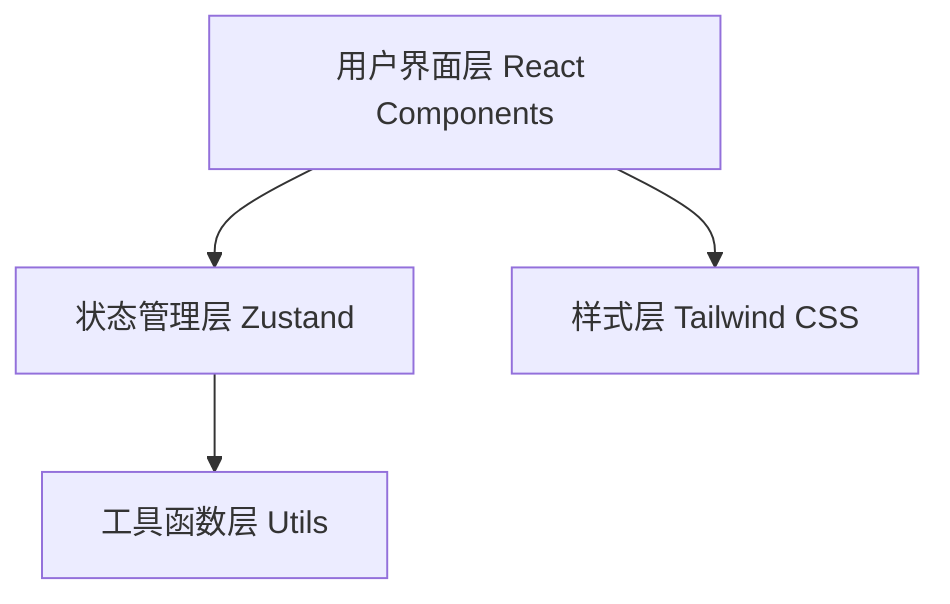

## 1. 架构设计



## 2. 技术描述

- **前端框架**：React@18 + TypeScript@5 + Vite@5
- **状态管理**：Zustand@4
- **样式方案**：Tailwind CSS@3
- **路由**：无需路由（单页面应用）
- **图标库**：lucide-react
- **构建工具**：Vite
- **包管理器**：npm

## 3. 项目结构

```
src/
├── components/
│   ├── BorderControls/
│   │   ├── BorderPanel.tsx      # 边框控制面板
│   │   └── ShadowPanel.tsx      # 阴影控制面板
│   ├── Preview/
│   │   └── PreviewBox.tsx        # 预览盒子
│   ├── CodeOutput/
│   │   └── CodeOutput.tsx        # CSS代码输出区
│   ├── common/
│   │   ├── Slider.tsx            # 自定义滑块组件
│   │   ├── ColorPicker.tsx       # 颜色选择器组件
│   │   └── Select.tsx               # 下拉选择组件
│   └── Layout/
│       └── Header.tsx              # 页头组件
├── store/
│   └── useStyleStore.ts          # 样式状态管理
├── utils/
│   └── cssGenerator.ts          # CSS代码生成器
├── types/
│   └── index.ts                 # 类型定义
├── App.tsx                     # 主应用组件
├── main.tsx                    # 入口文件
└── index.css                   # 全局样式
```

## 4. 数据模型

### 4.1 类型定义

```typescript
// 边框样式类型
type BorderStyle = 'solid' | 'dashed' | 'dotted';

// 边框配置
interface BorderConfig {
  width: number;        // 边框宽度 (px)
  style: BorderStyle; // 边框样式
  color: string;     // 边框颜色
  radius: number;   // 圆角 (px)
}

// 阴影类型
type ShadowType = 'outer' | 'inner';

// 阴影配置
interface ShadowConfig {
  id: string;       // 唯一标识
  type: ShadowType;  // 内阴影/外阴影
  offsetX: number; // 水平偏移 (px)
  offsetY: number; // 垂直偏移 (px)
  blur: number;    // 模糊半径 (px)
  spread: number;  // 扩展半径 (px)
  color: string;   // 阴影颜色
}

// 全局样式状态
interface StyleState {
  border: BorderConfig;
  shadows: ShadowConfig[];
  activeShadowId: string | null;
}
```

## 5. 核心功能实现

### 5.1 CSS 代码生成器

- 输入：BorderConfig + ShadowConfig[]
- 输出：格式化的 CSS 代码字符串
- 支持：多阴影拼接、属性排序、缩进格式化

### 5.2 状态管理

- 使用 Zustand 管理全局样式状态
- 提供更新边框、添加阴影、删除阴影、切换阴影类型等 action
- 支持状态变更自动触发预览更新

### 5.3 组件通信

- 所有组件通过 Zustand
  订阅状态
- 控制面板修改状态 → 预览组件自动更新
- 代码输出区实时计算 CSS 代码
